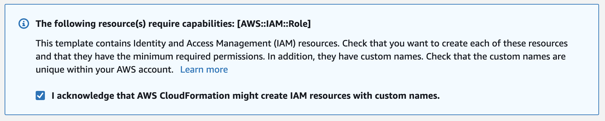

## Intro to the workshop

This workshop will provide guidelines on how to deploy an application from scratch in Amazon Elastic Kubernetes Service environment while protecting and enhancing the application availability and usability with Nginx solutions.

For this workshop we are going to use the "Arcadia Financial" application.
The application is built with 4 different microservices that are deployed in the Kubernetes environment.
- Main - provides access to the web GUI of the application for use by browsers
- Backend - is a supporting microservice and provides support for the customer facing services only
- App2 - provides money transfer API based functionalities for both the Web app and third party consumer applications
- App3 - provides referral API based functionalities for both the Web app and third party consumer applications

By the end of the workshop the "Arcadia Financial" will be fully deployed and protected as described in the bellow diagram.

## AWS Workshop Portal

This workshop creates an AWS account and a Cloud9 environment. You will need the **Participant Hash** provided upon entry, and your email address to track your unique session.

1. Connect to the portal by clicking the button or browsing to [https://dashboard.eventengine.run/](https://dashboard.eventengine.run/). The following screen shows up.

2. Enter the provided hash in the text box. The button on the bottom right corner changes to **Accept Terms & Login**. Click on that button to continue.
  
&nbsp;&nbsp;

&nbsp;&nbsp;

3. Click on **AWS Console** on dashboard.  

&nbsp;&nbsp;

&nbsp;&nbsp;

4. Accept the defaults and make sure the region is `eu-central-1`. Click on **Open AWS Console**. This will open AWS Console in a new browser tab.

&nbsp;&nbsp;

## CloudFormation
5. Once you have completed the step above, please deploy the following template:

  
Click 'Next' accepting all the defaults, but make sure the following is selected on the last screen:

&nbsp;&nbsp;

6. Please wait until the stack Status is `CREATE_COMPLETE`.

## IAM Role

7. Follow [this deep link to find your Cloud9 EC2 instance](https://console.aws.amazon.com/ec2/v2/home?#Instances:tag:Name=aws-cloud9-ideNGINX.*;sort=desc:launchTime)
8. Select the instance, then choose **Actions / Instance Settings / Attach/Replace IAM Role**

9. Choose **eksworkshop-admin** from the **IAM Role** drop down, and select **Apply**

Now, lets start and clone the git repository that will help us during the workshop.

> git clone https://github.com/sorinboia/nginx-experience-aws

#### [Next part](3tf.md)
