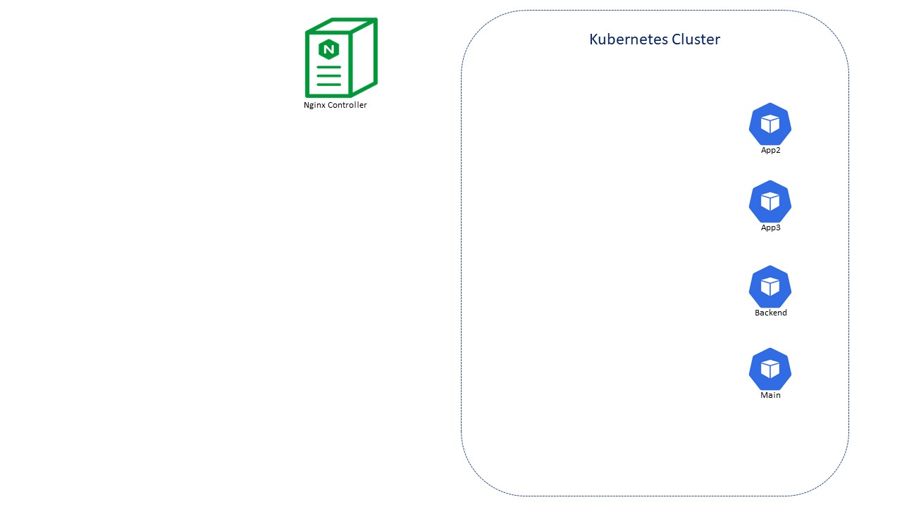

## Deploy your application with NGINX Unit Application Server

Our next step will be to deploy our application in the Kubernetes environment.  
As stated before these are the 4 microservices which we will deploy.
- Main - provides access to the web GUI of the application for use by browsers
- Backend - is a supporting microservice and provides support for the customer facing services only
- App2 - provides money transfer API based functionalities for both the Web app and third party consumer applications
- App3 - provides referral API based functionalities for both the Web app and third party consumer applications

Let deploy the app
<pre>
Command:
kubectl apply -f files/5ingress/1arcadia.yaml

Output:
deployment.apps/arcadia-main created  
deployment.apps/arcadia-backend created  
deployment.apps/arcadia-app2 created  
deployment.apps/arcadia-app3 created  
service/arcadia-main created  
service/arcadia-backend created  
service/arcadia-app2 created  
service/arcadia-app3 created  
</pre>

Let check that all is deployed and working as expected:  
<pre>
Command:
kubectl get pods

Output:
NAME                              READY   STATUS    RESTARTS   AGE  
arcadia-app2-64ccdcdc97-2vn6w     1/1     Running   0          38s  
arcadia-app3-5d76bf776b-sj446     1/1     Running   0          38s  
arcadia-backend-bc96d5754-grwfn   1/1     Running   0          38s  
arcadia-main-5d9bc94d55-cc597     1/1     Running   0          39s  
</pre>

<pre>
Command:
kubectl get svc -owide

Output:
NAME           TYPE           CLUSTER-IP       EXTERNAL-IP                                                                 PORT(S)        AGE    SELECTOR  
arcadia-app2   ClusterIP      172.20.215.142    none                                                                       80/TCP         23m    app=arcadia-app2  
arcadia-app3   ClusterIP      172.20.97.115     none                                                                       80/TCP         23m    app=arcadia-app3  
arcadia-main   ClusterIP      172.20.102.115    none                                                                       80:32065/TCP   23m    app=arcadia-main  
backend        ClusterIP      172.20.84.9       none                                                                       80/TCP         5s     app=arcadia-backend  
kubernetes     ClusterIP      172.20.0.1        none                                                                       443/TCP        108m    none   
</pre>

All of our pods are created based on the Nginx Unit application server.
NGINX Unit is a dynamic application server, capable of running beside NGINX Plus and NGINX Open Source or standalone. Unit supports a RESTful JSON API, deploys configuration changes without service disruptions, and runs apps built with multiple languages and frameworks. Designed from scratch around the needs of your distributed applications, it lays the foundation for your service mesh.

The main features are:  
##### Polyglotism
Configure all your applications with one streamlined interface:
- Uniform support for Go, Node.js, Perl, PHP, Python, and Ruby
- Applications written in different languages run on the same server
- Different versions of a language run side by side (PHP 5 and PHP 7, Python 2.7 and Python 3)

##### Programmability
Adjust to your applications’ needs on-the-fly:
- Comprehensive RESTful API simplifies configuration
- JSON syntax provides visibility and transparency
- In‑memory updates reduce service disruptions
- Zero-downtime deployments facilitate seamless updates

##### Service Mesh
Use NGINX Unit as the foundation for your service mesh:
- Integrated network stack for fast service-to-service communication
- Offload network configuration from application code to NGINX Unit
- Built-in SSL/TLS support

More information can be found [here](https://www.nginx.com/products/nginx-unit/#resources).  

#### [Next part](5ingress.md)
