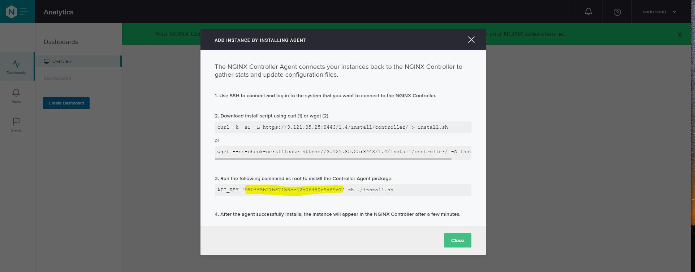

## The Nginx Controller

We have finished the first part of the publishing our application, now we want to publish our APIs to be used by third party organizations.  
We will acomplish this using two components:
- Nginx Controller which will be used as an API Management
- Nginx Container will be the API Microgateway which will reside within the Kubernetes environment


1. The Nginx Controller has already been deployed with the terraform declaration, we need to find the public IP address.

<pre>
Command:
cd terraform
terraform state show "aws_instance.controller" | grep "public_ip"

Output:
    associate_public_ip_address  = true
    public_ip                    = "18.184.134.91"
</pre>

2. Change the directory back to the original repo folder:
```
cd ..
```

3. Browse (using `HTTPS`) to the IP address of the Controller:

```
Username (email): nginx@f5.com
Password: Admin2020
```

4. The next step is getting the API key to connect the microgateway so it is managed by the controller.
Once you login - the first thing you will see is the API key, save it for later.




5. Now let's deploy the microgateway with the following configuration.  

:warning: Please note: you need to replace the IP address of the controller and the API key value you saved in the previous step.
Create a new file `microgw.yaml`:

<pre>
apiVersion: apps/v1
kind: Deployment
metadata:
  name: microgateway
spec:
  replicas: 1
  selector:
    matchLabels:
      app: microgateway

  template:
    metadata:
      labels:
        app: microgateway
    spec:
      containers:
        - name: microgateway1
          image: sorinboia/ngtest:3.4
          imagePullPolicy: Always
          env:
            - name: API_KEY
              value: <REPLACE WITH THE API KEY>
            - name: CTRL_HOST
              value: <REPLACE WITH CONTROLLER IP ADDRESS>
            - name: HOSTNAME
              value: microgateway1            
          ports:
            - containerPort: 80
          readinessProbe:
            exec:
              command:
                - curl
                - 127.0.0.1:49151/api
            initialDelaySeconds: 5
            periodSeconds: 5
            
---

apiVersion: v1
kind: Service
metadata:
  name: microgateway
spec:
  selector:
    app: microgateway
  ports:
    - port: 80
      targetPort: 80
      name: http
    - port: 443
      targetPort: 443
      name: https
  externalTrafficPolicy: Local
  type: LoadBalancer
</pre>

From now on we will only use the Controller GUI do to all of our configuration.  
The end goal will be to expose and protect our APIs both internally within the cluster and externally to other programmers.  

6. Login to the Nginx Controller web UI, click the "N" button in the upper left corner and go to "Infrastructure" -> "Instances".  

You will see the microgateway we just deployed listed. If it is not there wait for about 2 minutes, it might take a little bit of time for the instance to register.

7. Let's get the EXTERNAL-IP of the microgateway service we just published, we will use it later within our config.  

<pre>
Command:
kubectl get svc microgateway

Output:
NAME           TYPE           CLUSTER-IP     EXTERNAL-IP                                                                 PORT(S)                      AGE
microgateway   LoadBalancer   172.20.181.0   ae0aa9bf7704745fbb2a47da2c3a2039-258004477.eu-central-1.elb.amazonaws.com   80:31424/TCP,443:32040/TCP   21h
</pre>


8. Now we will build our configuration:
##### "N" -> "Services" -> "Environments" -> "Create Environment"  
In all the fields, enter the following value: `prod`.

Click on "View API Request".  
All the configuration on the Nginx Controller can be easlly automated with external orchestration systems, this view can help you in understanding how to generate the configuration API calls.  

The output will look like this:
<pre>
{
  "metadata": {
    "name": "prod",
    "displayName": "prod",
    "description": "prod",
    "tags": [
      "prod"
    ]
  },
  "desiredState": {}
}
</pre> 

Click "Submit".

9. Create the Certificate:  

##### "N" -> "Services" -> "Certs" -> "Create Cert"
> Name: server-cert   
> Environment: prod  
> Chose "Copy and paste PEM text"  
> Private Key: Browse to https://raw.githubusercontent.com/sorinboia/nginx-experience-aws/master/certs_for_mtls/ca.key copy and paste.  
> Public Cert: Browse to https://raw.githubusercontent.com/sorinboia/nginx-experience-aws/master/certs_for_mtls/ca.pem copy and paste.  
< Submit

10. Create the Gateway:  

##### "N" -> "Services" -> "Gateways" -> "Create Gateway"
> Name: api.arcadia.aws.cloud
> Environment: prod  
> Instance Refs: Select All  
> Hostname: https://<EXTERNAL-IP OF THE "microgateway" SERVICE>  
> Cert Reference: server-cert  
> Submit


11. Create the App: 

##### "N" -> "Services" -> "Apps" -> "Create App"
> Name: arcadia-api   
> Environment: prod  
> Submit

  
  
So far we have created an environment, uploaded the certificate/key that we will use for our HTTPS connection, created a gateway which represents our entry point into the API gateway and last defined a new application object.  
  
  
Next we are going to publish the application APIs to the world.   
There are two ways of creating this configuration, the first one is manual similar to the way we performed the configuration until this point and the second one is described bellow.  


As part of their development cycle, the developers of the Arcadia application are generating an [OpenApi](https://swagger.io/docs/specification/about/) specification to describe their APIs.  
We are going to use this API specification in order to publish the services to the world.

12. Run the following curl commands.  

:warning: Please note: you need to replace the IP address of the controller.  

<pre>
Commands:
curl -k -c cookie.txt -X POST --url "https://[CHANGE TO CONTROLLER IP ADDRESS]/api/v1/platform/login" --header 'Content-Type: application/json' --data '{"credentials": {"type": "BASIC","username": "nginx@f5.com","password": "Admin2020"}}'  
curl -k -b cookie.txt -c cookie.txt --location --request PUT 'https://[CHANGE TO CONTROLLER IP ADDRESS]/api/v1/services/api-definitions/arcadia-api/oas-config' --header 'Content-Type: application/json' --header 'Content-Type: text/plain' --data "@files/6controller/arcadia_api_spec.json"
</pre>

We have just uploaded the OpenApi spec to the Nginx Controller.  

13. Go to "N" -> "Services" -> "APIs" -> "API Definitions".  
You can see the "Arcadia API" definition listed.  

Click the "Pen" icon of the "Arcadia API" and you can see a list of the defined API endpoints.  
 
14. Now we are going to check the DNS name of the backend servers we need to point our APIs to:
 <pre>
 Command:
 kubectl get svc
 
 Output:
 NAME              TYPE           CLUSTER-IP       EXTERNAL-IP                                                                 PORT(S)                      AGE
 arcadia-app2      ClusterIP      172.20.103.189   none                                                                        80/TCP                       171m
 arcadia-app3      ClusterIP      172.20.238.13    none                                                                        80/TCP                       171m
 arcadia-backend   ClusterIP      172.20.228.83    none                                                                        80/TCP                       109m
 arcadia-main      ClusterIP      172.20.166.2     none                                                                        80/TCP                       7s
 backend           ClusterIP      172.20.44.133    none                                                                        80/TCP                       171m
 kubernetes        ClusterIP      172.20.0.1       none                                                                        443/TCP                      8h
 microgateway      LoadBalancer   172.20.81.110    a2fa7314165114fb9b16ebd92a890078-367878391.eu-central-1.elb.amazonaws.com   80:32293/TCP,443:32428/TCP   12m
 </pre>

We are interested in "main" and "app2" and their DNS names are `arcadia-main` and `arcadia-app2`.

15. Create the workloads:
##### "N" -> "Services" -> "APIs" -> "Workload Groups" -> "Create a Workload Group"
Create the configuration of each of the workloads:  

> Name: arcadia-app2  
> Click Save  

Add a Workload:
> First input: arcadia-app2  
> Port: 80  

Repeat the steps above for `arcadia-main`. 
   
16. Add a Published API:  

Return to "N" -> "Services"-> "APIs" -> "API Definitions" -> "Arcadia API" -> "Pen" Icon -> "Add a Published API":

> Published API Name: arcadia-pub-api  
> Environment: prod  
> Application: arcadia-api  
> Gateways: api.arcadia.aws.cloud  

Save  

17. Click on 'Add a route':  

> All URLs that start with /api - assign the "arcadia-app2" workload  
> All URLs that start with /trading - assign the "arcadia-main" workload

After adding each route click Save.  

When done click "Publish".  


Once the public API has been published - we need to take similar steps for the internal APIs that are accessing the Arcadia Backend service.  

18. Create the Environment:

##### "N" -> "Services" -> "Environments" -> "Create Environment"  
> Name: internal  
> Tags: internal

19. Create the Gateway:

##### "N" -> "Services" -> "Gateways" -> "Create Gateway"
> Name: backend   
> Environment: internal  
> Instance Refs: Select All  
> Hostname: http://backend  

20. Create the App:
##### "N" -> "Services" -> "Apps" -> "Create App"
> Name: arcadia-backend   
> Environment: internal

21. We could continue and import the OpenApi spec of the backend service as before, but now we want to present the load balancing configuration when developers don't have the specs at hand.

##### "N" -> "Services" -> "Apps" -> "arcadia-backend" -> "Create Component"  
> Name: backend-component  
> Error Log: V   
> Access Log: V    
> Gateway Refs: backend  
> URIs: /  
> Workload Group Name: arcadia-backend    
> URI: http://arcadia-backend  

22. Now we just need to tell kubernetes to point to the microgateway instead of directly to the pods.
<pre>
cat << EOF | kubectl apply -f -
apiVersion: v1
kind: Service
metadata:
  name: backend
  labels:
    app: microgateway
spec:
  ports:
  - port: 80
    targetPort: 80
    protocol: TCP
  selector:
    app: microgateway
EOF
</pre>


Next we are going to test an API call to our published APIs.  

Run the bellow curl command.
<pre>
Command:
curl -k --location --request POST 'https://[EXTERNAL-IP OF THE "microgateway" service]/api/rest/execute_money_transfer.php' --header 'Content-Type: application/json' --data-raw '{"amount":"77","account":"2075894","currency":"EUR","friend":"Alfredo"}'
</pre>
You should receive a success message and if you go to the main application and refresh the page you will be able to see the transaction we just did in the "Transfer History" location.

All looks good but we are not done, we should add some security to our API and enable access with access keys.

##### "N" -> "Services" -> "APIs" -> "Identity Provider" -> "Create an Identity Provider"
> Name: api-protect  
> Environment: prod  
> Type: API Key
> Create  
> Create a client  
> Name: test  
> Save

Copy the key that was just create and save it for later.

###### "N" -> "Services" -> "APIs" -> "API Definitions" -> "Pen" icon next to "arcadia-pub-api"
> Add a policy  
> Policy Type: Authentication  
> Identity Provider: api-protect
> Credential Location apikey: HTTP request header  
> Header name: apikey    
> Save  
> Publish

Now in order to check that all is working as expected we will do the following:
We will run the preview curl command and we will recevie a 401 status code.

<pre>
curl -k --location --request POST 'https://[EXTERNAL-IP OF THE "microgateway" service]/api/rest/execute_money_transfer.php' --header 'Content-Type: application/json' --data-raw '{"amount":"77","account":"2075894","currency":"EUR","friend":"Alfredo"}'
</pre>

Now we will run the same command but now we will include the "apikey" header with the api key we previously generated and the transaction will succeed again.

<pre>
Commands:
export apikey=[REPLACE WITH THE PREVIOUSLY SAVE API KEY]
curl -k --location --request POST 'https://[EXTERNAL-IP OF THE "microgateway" service]/api/rest/execute_money_transfer.php' --header "apikey: $apikey" --header 'Content-Type: application/json' --data-raw '{"amount":"77","account":"2075894","currency":"EUR","friend":"Alfredo"}'
</pre>


All of our microgateway api configuration is finished. We have published both external and internal APIs and are able to gather and view statistics for traffic coming from external clients and also internally when a service is contacting anther. We have achieved the bellow architecture. 


#### [Next part](7security.md)
